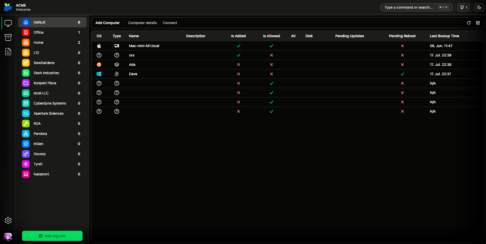

# Open-RMM

It's been **O** days since last rewrite

## Dashboard preview

## About

_I don't know what I am doing._

"Simple" service for monitoring Windows, Mac and Linux computers.

Some todo info [here](./docs/todo.md).

### Stack

#### Dashboard

- [SvelteKit](https://svelte.dev/) (with all the related bells and whistles, read: all the default packages) - full stack framework
- [TailwindCSS](https://tailwindcss.com/) - CSS library
- [Shadcn svelte](https://shadcn-svelte.com/) - Component library
- [Lucide icons](https://lucide.dev/) - Icons
- [Supabase](https://supabase.com/) - Backend as a Service (open-source and self-hostable)

#### Agent

- UUID
- reqwest
- tokio (Tokioooooo)
- serde
- postgrest
- anyhow
- chrono
- sysinfo
- clap

## Toolchain dependencies

- **pnpm** (node stuff)
  - [install node](https://nodejs.org/en/download/current)
  - [install pnpm](https://pnpm.io/installation)
- **cargo** (rust)
  - [install rust toolchain with rustup](https://rustup.rs/)
